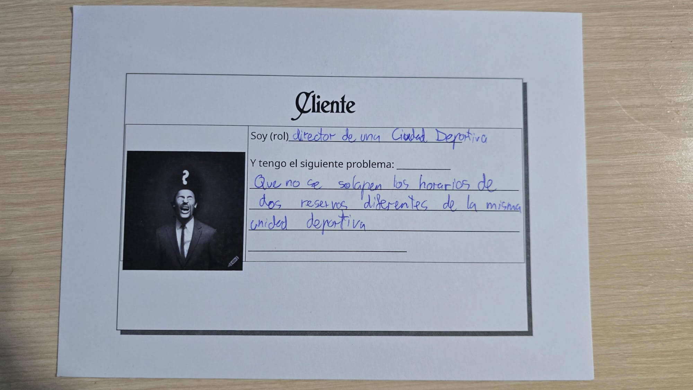

# ReservasDeportivas

## Problema

El director de una ciudad deportiva, la cual dispone de 1 campo de futbol 11, dos de futbol 7, una piscina, un pabellon, 2 pistas de tennis, y 4 de pádel, tiene un problema, y es que le cuesta evitar que las reservas de sus instalaciones deportivas sean incompatibles, por ejemplo, una vez tuvo el problema de que coincidieron dos equipos de futbol para entrenar en el campo de futbol 11, y uno acabó poniendo una hoja de reclamaciones.
Este problema lo conozco, porque he jugado en un equipo de balonmano, y hemos tenido que hacer reservas para el pabellón y varias veces para entrenamientos especiales otras instalaciones como la piscina

## Datos de las reservas de las instalaciones

Se puede reservar una o varias instalaciones un tiempo mínimo de una hora, por lo que se necesita, la instalación a reservar, el dia, la hora de inicio, y la hora de final.
Estos datos están disponibles en el registro de la ciudad deportiva

## Qué se necesita analizar

El director debe evitar que se solapen los horarios de reservas entre diferentes clientes, tambien se debe analizar la ocupación de las instalaciones, y saber que horarios tienen mas demanda

## Documentación

[configuracion del repositorio](docs/configuracion.md)

## Juego de rol

